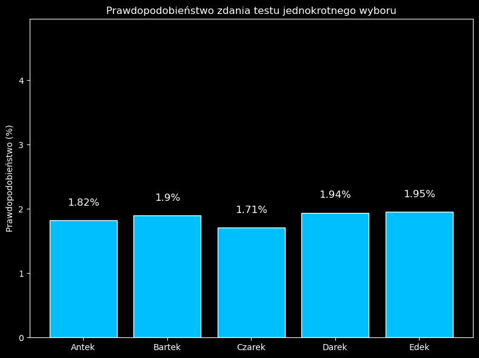

# Monte Carlo Simulation of Multiple-Choice Test Strategies

## What was done

This project simulates a scenario where a student takes a 10-question multiple-choice test (with four options: A, B, C, D), answering all questions randomly without knowing the correct answers. The goal is to evaluate whether certain guessing strategies can statistically improve the chances of passing the test by chance alone.

Five different guessing strategies (A–E) were tested and compared using a Monte Carlo approach. The test is considered "passed" if at least 6 out of 10 questions are answered correctly.

## How it was done

The simulation was repeated 10,000 times for each of the following guessing strategies:

- **Strategy A** – Each answer (A, B, C, D) is chosen with equal probability (25% each).
- **Strategy B** – Preference for answers A and B: A = 40%, B = 40%, C = 10%, D = 10%.
- **Strategy C** – Always selects answer B.
- **Strategy D** – Cyclic zigzag pattern: A, B, C, D, C, B, ...
- **Strategy E** – Each answer is chosen uniformly at random, but no answer can be the same as the one given in the previous question.

Subsequently, for each strategy, a **statistical significance test** was performed to verify whether the observed probability of passing significantly differs from a benchmark value of **1.97%**, which is the theoretical probability of passing by chance under the binomial distribution with p = 0.25.

The hypothesis test used:
- Null hypothesis (H₀): true passing probability = 1.97%
- Alternative hypothesis (H₁): true passing probability ≠ 1.97%
- Sample size: n = 10,000
- Significance level: α = 0.05

Each strategy’s p-value and z-score were computed to determine statistical significance.

## Results

Although the simulation revealed small differences in pass rates between the strategies, **none of them** proved to be statistically significantly better than the others. This suggests that no strategy provides a real advantage when taking such a test blindly.

---

